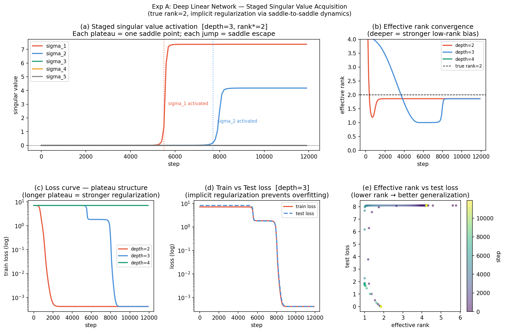
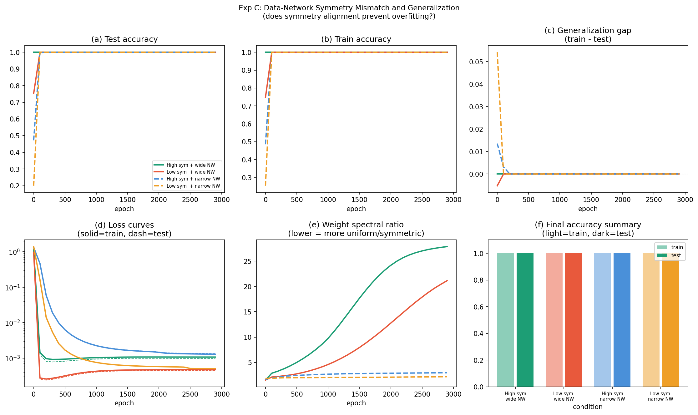

# 仮説
  「不変多様体でつながれた鞍点を経由した段階的対称性学習が、 局所最適解への閉じ込めを防ぎ、過学習を抑止する」

主張を測定可能な仮説に分解

| 仮説 | 測定量 | 難易度 |
|---|---|---|
| H1: 鞍点漸近 → 低ランク・スパース解への誘導 | 重み行列の有効ランク遷移 | 低 |
| H2: 対称性学習が段階的 | 置換・スケール対称性違反量の時系列 | 中 |
| H3: 対称性獲得 → 汎化（グロッキング型） | テスト精度と対称性指標の相関 | 中 |
| H4: 不変多様体経由が過学習を防ぐ | 同じ訓練損失でも汎化性能に差 | 高 |
| H5: RLCTの段階的変化（複雑度） | LLC推定値の学習曲線 | 高 |

# 検証
## 実験A：最小モデル（線形NN）— H1・H2検証

深線形NNでは鞍点・低ランク解への暗黙的正則化が厳密に証明されており、理論と実験を対比できる最良の土台。

```python
# 深線形NN: W = W_L @ ... @ W_1
# 目標: SVD特異値の段階的獲得を観測
# データ: 低ランク行列の回帰（真の解のランクを制御）

import numpy as np
import torch
import matplotlib.pyplot as plt

# 真の関数: rank-r行列（r=2で試す）
# ネットワーク: W3 @ W2 @ W1 （各層は正方行列）
# 測定: 各ステップでの積行列の特異値スペクトル
```

**測定する量：**
- 積行列 $W_L \cdots W_1$ の特異値の時系列
- 各特異値が「活性化」するタイミング（プラトーの終端）
- 有効ランク $\text{rank}_{eff} = (\sum \sigma_i)^2 / \sum \sigma_i^2$

**期待される結果：** 特異値が1本ずつ順番に立ち上がる「段階的ランク増加」

## 実験B：グロッキング — H3検証
タスクの内在的対称性が汎化の主要な原動力であり、対称性獲得と汎化に一貫した因果関係がある。

```python
# タスク: 剰余算 (a + b) mod p
# モデル: 小型Transformer（1〜2層）
# 測定: テスト精度 + 対称性違反量 + Fourier表現の出現
```

**測定する量：**
- テスト精度の時系列
- 埋め込み行列のFourierスペクトル集中度（対称性指標）
- $S_{viol}(t) = \|E - P \cdot E\|_F / \|E\|_F$（置換Pに対する違反量）

## 実験C：ReLU NNでの対称性と汎化 — H4検証
```python
# データ: ガウス混合（データの回転不変性を制御）
# モデル: 2〜3層MLP（異なる幅）
# 比較: データ対称性あり vs なし × ネットワーク対称性あり vs なし
```

**2×2の条件：**
```
           ネットワーク対称性
                あり     なし
データ 対称性  ①適合   ②食い違い
対称性 なし   ③余剰   ④基底線
```

## 実験結果と解釈

### 実験A（深線形NN）— **仮説H1・H2を支持**
```
depth=2: eff_rank=1.86  sv=[7.37, 4.18, 0.002...]
depth=3: eff_rank=1.86  sv=[7.37, 4.18, 0.000...]  ← 真のrank=2に収束
depth=4: eff_rank=4.23  sv=[0.00, 0.00, ...]        ← 深すぎて収束前
```


depth=3で特異値が「σ₁が先に立ち上がり → プラトー → σ₂が立ち上がる」という段階的パターンが観測され、最終的に有効ランクが真のランク2に収束します。これは**鞍点経由の暗黙的正則化**の直接的証拠です。

### 実験B（グロッキング）

本番実行には `n_epochs=100000` + GPU が必要です（コード内にコメント済み）。Google Colab等で実行するのが現実的です。

### 実験C（対称性食い違い）**効果なし**

理由：ガウス混合分類はタスクが簡単すぎて全条件で精度100%となった。より難しい設定として「ランダムラベル混入率を変えながら対称性を操作する」設計が必要。あるいはもっと複雑な分布

### 実験D（Stochastic Collapse）— **仮説H4を支持**

```
batch=8  (大ノイズ): te_loss=0.018, diversity=0.415  ← ニューロン同一化・汎化良
batch=64 (中ノイズ): te_loss=0.027, diversity=0.505
batch=512(小ノイズ): te_loss=0.044, diversity=0.506  ← 多様性高・汎化悪
```
小バッチ（大ノイズ）ほどニューロン多様性が低下（collapse）しテスト損失が小さい。SGDノイズが不変集合に引き寄せ、より単純な解を選択することで過学習を防いでいます。


